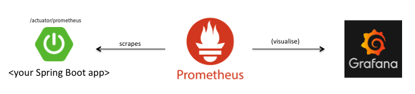
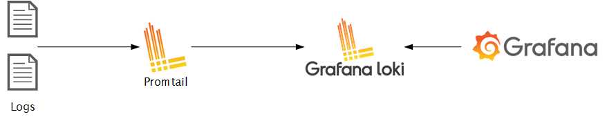

# currency-bot
## Project description
`IN PROGRESS`
## Database schema
`IN PROGRESS`
## Project infrastructure
All infrastructure services, like Spring application, are run as docker containers. This makes it easier to support the project as a whole, to start and stop it.
### Metrics

- `Micrometer` is a dimensional-first metrics collection facade whose aim is to allow you to time, count, and gauge your code with a vendor neutral API. Metrics are available through HTTP endpoint `/actuator/prometheus`.
- `Prometheus` stores metric data in the form of time series in memory, periodically retrieving them via `HTTP`. Data can be visualized using the console template language, the built-in expression browser, or by integrating `Grafana`.
- `Grafana` provides a rich user interface that allows you to create, explore and share dashboards containing multiple graphs, can receive data from various data sources, such as `Prometheus`, `Elasticsearch`, `InfluxDB` and also allows you to set up rule-based alerts that can then notify you via `Slack`, `Email`, `Hipchat`.
### Logging

- The logs of the `Spring` application are collected in the `main.log` file.
- `Promtail` is the log collector that collects the application’s logs from `main.log` and sends them to `Loki`.
- `Loki` is used for log storage and parsing, and provides a query API for downstream presentation.
- `Grafana` is responsible for visualizing `Loki’s` logs.
## How to run
Before launching the project, you need to create a telegram bot according to the docs https://core.telegram.org/bots and add it's nickname and token to the file `application.yml`.
```
bot:
  nickname: <bot_nikname>
  token: <bot_token>
```
Also, if you need to use a proxy to parse the site, you can set the proxy server parameters in the file `application.yml`.
```
proxy:
  enabled: true
  ip: <proxy_ip>
  port: <proxy_port>
  login: <proxy_login>
  password: <proxy_password>
```
To run a project with all its infrastructure, docker and docker-compose must be installed on your machine.
This command build images and start docker containers with services. Argument `--abort-on-container-exit` is necessary so that if any of the containers fall, the running containers will automatically stop.
```bash
$ docker-compose up --build --abort-on-container-exit
```
To stop running services, just press `Ctrl+C`.
